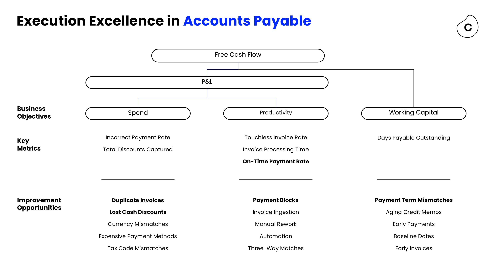
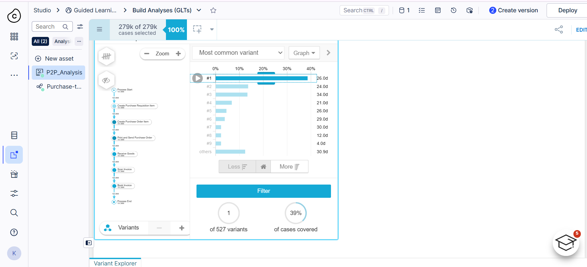
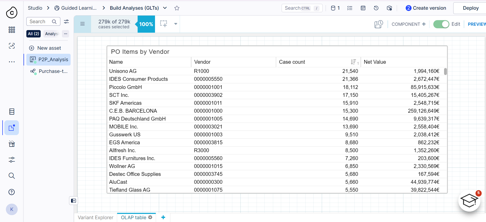
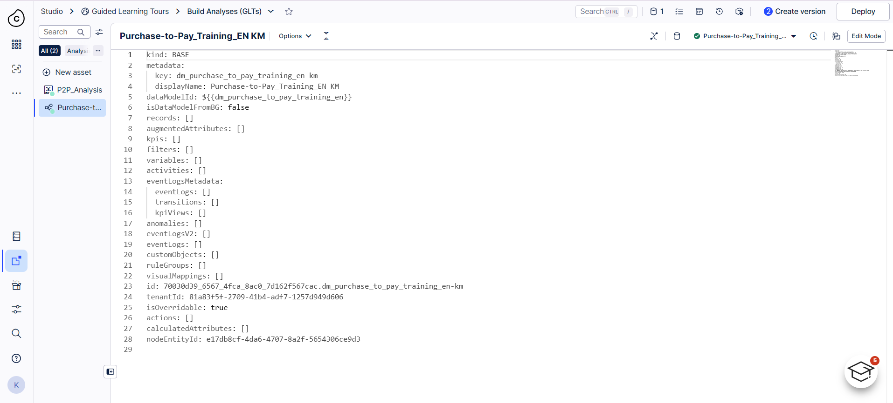

# Accounts Payable Value Framing Business Case
### A Process Mining Portfolio Project | Celonis Methodology Applied to Real P2P Data

<p align="center">
  
</p>

<p align="center">
  
  
  
  
  
</p>

---

## ✅ Project Overview

This project applies **Celonis's 6-Step Value Framing Methodology** to a real Purchase-to-Pay (P2P) event log dataset, producing an executive-ready business case for two high-priority Accounts Payable improvement opportunities:

1. **Payment Blocks & PO Blocks** — manual intervention driving process delays
2. **Price Deviations (Change Price activity)** — rework-heavy corrections adding cycle time

The analysis follows the **Celonis Value Delivery Framework** (Identify → Frame & Commit → Realize & Track) and is structured as a simulated consulting engagement — from raw data discovery through to executive sign-off.

> **Context**: This project was built as a portfolio deliverable following the Celonis × AICTE Virtual Business Analyst Internship, during which I earned certifications in Process Mining Fundamentals, Business Value Delivery, and Celonis Foundations.

---

## ✅ Business Problem

Accounts Payable teams operating in SAP-based environments frequently face hidden process inefficiencies that are invisible in standard ERP reports:

- Invoices blocked from payment due to price/quantity mismatches requiring manual resolution
- Purchase orders revised post-issuance, creating rework loops that delay goods receipt and invoice clearance
- Low automation rates meaning human capacity is spent on corrective work rather than value-added tasks
- No systematic framework for quantifying these inefficiencies or prioritizing remediation

**Without process-level visibility, organizations cannot make data-backed decisions about where to invest in automation, process redesign, or vendor management.**

---

## ✅ Repository Structure

```
ap-value-framing-business-case/
│
├── 📂 data/
│   ├── P2P-Cases.csv               # Case-level attributes (vendor, material, spend)
│   ├── P2P-Activities.csv          # Event log (activity, timestamp, user type)
│   └── data_dictionary.md          # Field definitions and assumptions
│
├── 📂 analysis/
│   ├── p2p_data_profiling.py       # Data profiling & EDA script
│   ├── deviation_analysis.py       # Variant & deviation classification
│   └── value_calculation.py        # Business case monetary value formulas
│
├── 📂 presentation/
│   └── AP_Value_Framing_Business_Case.pptx   # 10-slide executive deck
│
├── 📂 dashboard/
│   └── AP_Process_Dashboard.xlsx   # Excel KPI dashboard (5 sheets)
│
├── 📂 assets/
│   ├── ap_value_tree.png           # AP Value Tree screenshot
│   ├── celonis_variant_explorer.png
│   ├── celonis_olap_table.png
│   ├── celonis_data_model.png
│   └── celonis_kpi_model.png
│
├── 📂 docs/
│   ├── methodology.md              # 6-Step Value Framing documentation
│   ├── assumptions_log.md          # All business case assumptions
│   └── kpi_definitions.md          # KPI formulas & business logic
│
├── README.md
└── LICENSE
```

---

## ✅ Dataset Summary

| Attribute | Value |
|-----------|-------|
| **Source** | SAP-based P2P Training Dataset (Celonis Guided Learning) |
| **Total Cases (PO Items)** | 812 |
| **Total Events** | 4,927 |
| **Unique Activities** | 19 |
| **Total Procurement Spend** | €207,096 |
| **Unique Vendors** | 20 |
| **Date Range** | 2016 – 2017 |
| **System** | SAP ERP (Tables: LFA1, EKKO, EKPO + Activity Log) |

---

## ✅ Methodology: Celonis 6-Step Value Framing

This project implements all six steps as documented in Celonis's Value Delivery Framework:

```
Step 1: Qualify    → Assess Strategic Fit, Business Impact & Feasibility
Step 2: Quantify   → Calculate Expected Monetary Value per opportunity
Step 3: Investigate → Root cause categorization (Process / Time / Attribute)
Step 4: Validate   → Align KPI definitions with business logic
Step 5: Prioritize → Impact-Effort Matrix placement
Step 6: Commit     → Executive sign-off documentation
```

---

## ✅ Key Findings

### Process Health
| KPI | Value |
|-----|-------|
| Happy Path Cases | 537 (66.1%) |
| Deviant Cases | 275 (33.9%) |
| Total Deviation Events | 310 of 4,927 |
| Automation Rate | 47.5% |
| Manual Activity Rate | 52.5% |
| Average Cycle Time | 29.6 days |
| Maximum Cycle Time | 190 days |

### Top Deviation Activities
| Activity | Event Count | Business Impact |
|----------|-------------|-----------------|
| Change Price | 110 | Price mismatches → manual rework |
| Block Purchase Order Item | 38 | PO delays → extended cycle time |
| Set Payment Block | 20 | Invoice holds → delayed clearance |
| Change Currency | 20 | Currency mismatches → compliance risk |
| Delete Purchase Order Item | 20 | Procurement waste |

---

## ✅ Business Case Summary

### Opportunity 1: Resolve Payment & PO Blocks
> **Framing approach**: Labor productivity savings from reducing manual block resolution

| Parameter | Value |
|-----------|-------|
| Affected Events | 58 (Set Payment Block + Block PO Item) |
| Effort per manual resolution | 15 minutes |
| FTE Cost per minute | $0.42 (based on $90K/year FTE) |
| Realization Potential | 80% |
| **Expected Monetary Value** | **~$293 annually (sample dataset)** |

> *Note: This dataset is a training simulation with 812 cases. In a real enterprise deployment, scaling this ratio to 279,000 cases (as seen in Celonis platform screenshots) would produce savings in the range of $1.5M–$2.2M p.a., consistent with Celonis's published payment block benchmarks.*

### Opportunity 2: Eliminate Price Deviation Rework
> **Framing approach**: Reduce manual effort from 110 Change Price correction events

| Parameter | Value |
|-----------|-------|
| Affected Events | 110 |
| Effort per price correction | 10 minutes |
| FTE Cost per minute | $0.42 |
| Realization Potential | 70% |
| **Expected Monetary Value** | **~$323 annually (sample dataset)** |

---

## ✅ Platform Screenshots

### Celonis Variant Explorer — Process Flow Analysis
<p align="center">
  
</p>

*The most common variant (39% of 279k cases, 26-day cycle) follows the expected happy path: Process Start → Create PR → Create PO → Print & Send PO → Receive Goods → Scan Invoice → Book Invoice → Process End.*

---

### Celonis OLAP Table — PO Items by Vendor
<p align="center">
  
</p>

*Vendor spend analysis reveals high concentration: Piccolo GmbH (€85.9M), C.E.B. BARCELONA (€259M), PAQ Deutschland GmbH (€9.6M) represent key strategic supplier relationships warranting close monitoring.*

---

### Celonis Data Model — SAP Table Relationships
<p align="center">
  
</p>

*The P2P data model connects LFA1 (vendor master) → EKKO (PO header) → EKPO (PO items, case table) → _CEL_P2P_ACTIVITIES (activity log), joined on LIFNR/MANDT/EBELN keys.*

---

## ✅ Tools & Technologies

| Tool | Purpose |
|------|---------|
| **Celonis EMS** | Process mining platform — variant analysis, KPI calculation, OLAP tables |
| **Python (pandas)** | Data profiling, deviation classification, value calculation |
| **Microsoft Excel** | KPI dashboard, value tracking model |
| **PowerPoint** | Executive business case presentation |
| **SAP ERP** | Source system (LFA1, EKKO, EKPO tables) |

---

## ✅ How to Use This Repository

### 1. View the Business Case Presentation
Open `presentation/AP_Value_Framing_Business_Case.pptx` — a 10-slide executive deck following the Problem → Process → Analysis → Insights → Value → Recommendations storytelling arc.

### 2. Explore the Data
```bash
# Clone the repository
git clone https://github.com/YOUR_USERNAME/ap-value-framing-business-case.git
cd ap-value-framing-business-case

# Install dependencies
pip install pandas matplotlib seaborn

# Run data profiling
python analysis/p2p_data_profiling.py

# Run deviation analysis
python analysis/deviation_analysis.py

# View value calculations
python analysis/value_calculation.py
```

### 3. Open the Excel Dashboard
Open `dashboard/AP_Process_Dashboard.xlsx` — contains 5 sheets:
- **Overview**: KPI scorecard
- **Process Health**: Deviation & automation metrics
- **Deviation Analysis**: Activity-level breakdown
- **Value Calculator**: Interactive business case model
- **Vendor Analysis**: Vendor-level deviation rates


## 📧 Contact

Komal Harshita
CSE student

[](https://linkedin.com/in/komalharshita)
[](https://github.com/komalharshita)

---

*This project was developed as part of the Celonis × AICTE Virtual Business Analyst Internship (2026). All data used is from Celonis's Guided Learning environment and is used for educational portfolio purposes.*
